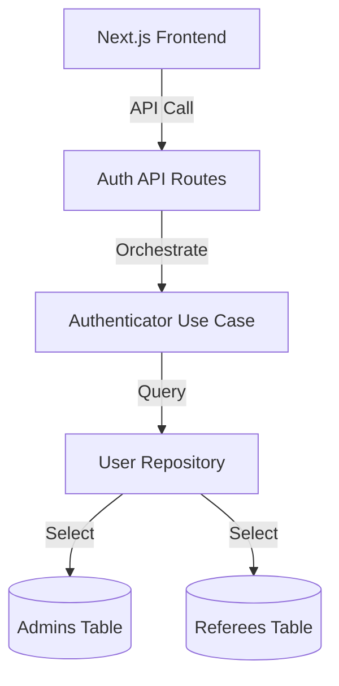

# Requirements

### Overview & Goals
Implement a role-based access control (RBAC) system for the Tournament Manager.
- **Admin**: Manage players, clubs, referees, and tournaments.
- **Referee**: Submit match reports.
- **Guest**: View tournament information.

### Scope
- **In Scope**:
  - Authentication system (Login/Logout).
  - Role-based navigation and dashboards.
  - Restricted access to management features for admins.
  - Restricted access to match reports for referees.
  - Default admin credentials (`admin`/`admin`).
- **Out of Scope**:
  - Password hashing (simple text for now to match default admin requirement).
  - Password reset functionality.

# Technical Design

### Current Implementation
- Referees are already stored in the database with `email` and `password`.
- No `User` entity or authentication mechanism exists.
- Home page shows all management options to everyone.

### Key Decisions
- **Unified Auth**: An `Authenticator` service will check both `admins` and `referees` tables.
- **Session Management**: Use HTTP-only cookies to store a simple session identifier or the user's role/id.
- **Role Mapping**:
  - `ADMIN`: Matches entry in `admins` table.
  - `REFEREE`: Matches entry in `referees` table.

### Proposed Changes
#### Database
- **Admins Table**: `admins (id UUID PRIMARY KEY, username TEXT NOT NULL UNIQUE, password TEXT NOT NULL)`
- **Seed**: Insert `('00000000-0000-0000-0000-000000000000', 'admin', 'admin')` into `admins`.

#### Backend (Contexts)
- **Auth Context**: `src/contexts/auth/user`
  - `User`: Entity representing the authenticated user.
  - `Authenticator`: Service to validate credentials.
- **PostgresUserRepository**: Implementation that queries both tables.

#### API
- `/api/auth/login`: POST to authenticate and set cookie.
- `/api/auth/logout`: POST to clear cookie.
- `/api/auth/me`: GET current user info.

#### Frontend
- **AuthContext**: React context to provide user data to components.
- **Header**: UI component for login/logout and navigation.
- **Home**: Role-based landing page.
- **Match Report**: Use session data for `refereeId`.

### Architecture Diagram

# Testing

### Validation Approach
- **Admin Login**: Verify access to registration forms and tournament creation.
- **Referee Login**: Verify access to match reports and correct `refereeId` submission.
- **Guest Access**: Verify that only the tournament list is visible on the home page when not logged in.
- **Security**: Verify that direct navigation to protected routes (e.g., `/tournaments/new`) is blocked for unauthorized users.

### Key Scenarios
1. Login as `admin`/`admin` -> See management options.
2. Login as a registered referee -> See "Entrega de Acta" option.
3. Access as guest -> See only the list of tournaments.

# Delivery Steps

### ✓ Step 1: Database Setup: Admins table and seeding
Add the `admins` table to the database and seed the default admin user.

- Update `databases/init.sql` to create the `admins` table.
- Insert the default admin user (`admin`/`admin`) into the `admins` table.
- Ensure the `referees` table is ready for authentication (it already exists with `email` and `password`).

### ✓ Step 2: Backend: Auth Context Implementation
Implement the `auth` context in `src/contexts/auth` following DDD and Onion Architecture.

- Create `User` domain entity with `id`, `username`, `password`, and `role` ('ADMIN' or 'REFEREE').
- Create `UserRepository` interface and `PostgresUserRepository` implementation.
- Implement `Authenticator` application service to validate credentials.
- Register new services in `diod.config.ts`.

### ✓ Step 3: Backend: Auth API Routes
Create the API routes for login, logout, and retrieving current user information.

- Implement `src/app/api/auth/login/route.ts` using cookies for session management.
- Implement `src/app/api/auth/logout/route.ts` to clear authentication cookies.
- Implement `src/app/api/auth/me/route.ts` to expose current user data to the frontend.

### ✓ Step 4: Frontend: Login and Header Integration
Build the login page and integrate authentication into the global layout.

- Create `src/app/login/page.tsx` with a login form in Spanish.
- Add a `Header` component (or update `RootLayout`) to include login/logout buttons and user status.
- Ensure the header is displayed across all pages.

### ✓ Step 5: Frontend: Role-based UI and Access Control
Update the Home page and Match Report page to support role-based access control.

- Refactor `src/app/page.tsx` to show tournaments for guests and specific options for Admin/Referee.
- Protect administrative routes (e.g., creating tournaments, players) by checking the user's role.
- Update `src/app/matches/[id]/report/page.tsx` to use the logged-in referee's ID and restrict access.